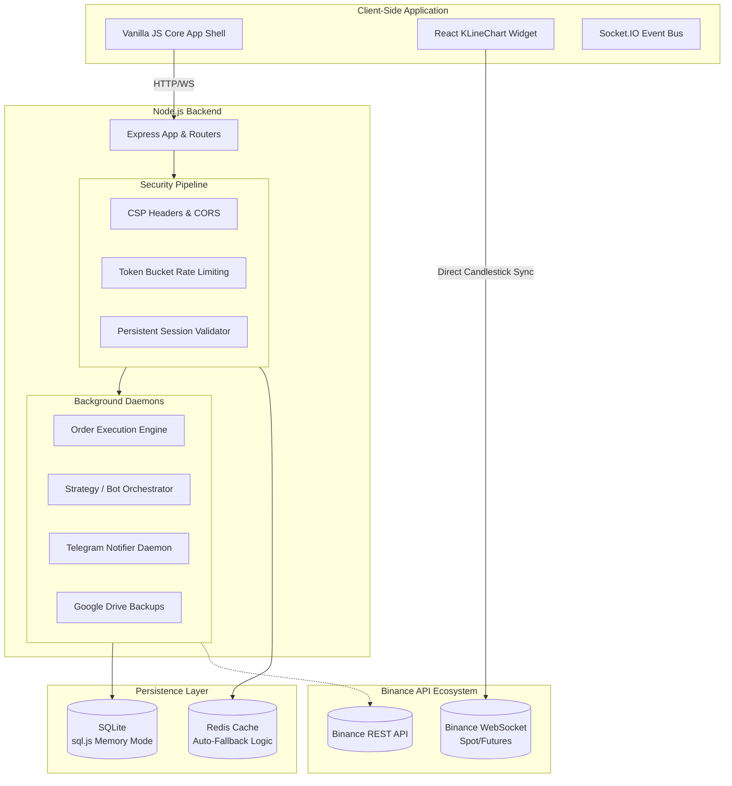

<div align="center">
  

  <h1>🚀 YAMATO TRADING PLATFORM (Defisit)</h1>
  <p><em>Advanced Crypto Trading Ecosystem 🔹 Automated Bots 🔹 Real-Time Data 🔹 Uncompromised Security</em></p>

  <p>
    <a href="https://github.com"></a>
    <a href="https://nodejs.org"></a>
    <a href="https://expressjs.com"></a>
    <a href="https://react.dev/"></a>
    <a href="https://redis.io"></a>
    <a href="https://socket.io"></a>
  </p>
  
  <p>
    <b>A full-featured, self-hosted cryptocurrency trading platform built for speed and security. Seamlessly integrates with Binance for real-time market data, automated trading bots, advanced charting (TradingView style), and robust portfolio management.</b>
  </p>
</div>

---

## 📖 Table of Contents
1. [🌟 Overview](#-overview)
2. [✨ Core Features & Capabilities](#-core-features--capabilities)
3. [🛠 Technology Stack](#-technology-stack)
4. [🏗 System Architecture](#-system-architecture)
5. [🗄️ Database Architecture](#️-database-architecture)
6. [🚀 Installation & Setup Guide](#-installation--setup-guide)
7. [📂 Project Structure](#-project-structure)
8. [🌐 API & WebSocket Reference](#-api--websocket-reference)
9. [🔐 Security Implementations](#-security-implementations)
10. [🖥 Production Deployment](#-production-deployment)
11. [🤝 Community & Support](#-community--support)

---

## 🌟 Overview

Yamato (Defisit) is not just a trading bot—it's a comprehensive, self-hosted crypto trading ecosystem. By direct integration with the Binance API, Yamato delivers real-time market streaming, ultra-low latency order execution, and a responsive UI that adapts to market volatility.

Whether you are a retail trader looking for a clean UI, an algorithmic institutional trader needing bot infrastructure, or a platform administrator requiring deep oversight, Yamato provides the tools out-of-the-box.

> [!TIP]
> **Why choose Yamato?** It ensures maximum privacy by being self-hosted, eliminates third-party subscription fees, and offers a robust PM2-ready microservices architecture. It combines Vanilla JS performance for the shell and React/TypeScript power for complex charting.

---

## ✨ Core Features & Capabilities

### 📈 Advanced Trading & Live Interface
* **Real-Time Data Streams:** Direct WebSocket connections to Binance for sub-second updates on Spot and Futures markets.
* **Pro-Grade Charts:** Embedded high-performance KLineChart widgets (TradingView style) built with React. Tools include Fibonacci retracements, moving averages, and volume profiling.
* **Portfolio & P&L Mastery:** Real-time calculation of Average Entry Prices, Unrealized/Realized P&L, Maker/Taker fee calculations, and monthly performance snapshots.
* **Risk-Free Demo Mode:** Practice makes perfect. Every account receives a virtual 10,000 USDT faucet to test strategies in a simulated live environment before deploying real capital.

### 🤖 Algorithmic Bots & Automation
* **Three Specialized Bot Engines:**
  * **AI / Stateful Bots:** Reacts to complex indicators and market sentiment.
  * **Grid Trading:** High-frequency grid placement to capture sideways market volatility.
  * **Neutral / Statistical Bots:** Mean-reversion and statistical arbitrage capabilities.
* **Copy Trading Platform:** Allow users to subscribe to high-performing traders. The system automatically calculates position sizing and scaling factors based on proportional account equity.
* **Smart Alerts System:** Push notifications and Telegram integrations for Take-Profit (TP) hits, Stop-Loss (SL) triggers, liquidations, and daily portfolio summaries.

### 🔐 Enterprise-Grade Security
* **Multi-Layer Authentication:** Supports 6 different methods including Email/Password, Hardware Passkeys (WebAuthn/FIDO2), TOTP (Google Authenticator), Telegram Widget Auth, and API Telegram Codes.
* **Smart Rate Limiting:** Redis-backed token bucket algorithms preventing DDoS and API abuse, with a seamless memory-map fallback if Redis fails.
* **Intelligent Threat Detection:** IP and Email locking upon sequential failed logins, malicious User-Agent blocking, and aggressive Helmet.js CSP headers.

### 🛠 Administrative Oversight
* **Role-Based Access Control (RBAC):** Over 10 granular hierarchical permissions (`ADMIN`, `SUPPORT`, `TRADER`, `OBSERVER`).
* **Deep System Auditing:** Meticulous logging of IP addresses, geolocations, and activity trails for every platform action.
* **Automated Cloud Backups:** Cron jobs take encrypted snapshot backups of the database and push them to Google Drive via OAuth.

---

## 🛠 Technology Stack

### Frontend (User Interface)
* **Core Interface:** HTML5, CSS3, Vanilla JavaScript (Zero-dependency UI shell for maximum speed).
* **Charting Module (`_src/`):** React 18, TypeScript, Vite, Core `klinecharts` API.
* **WebSockets Engine:** `socket.io-client` v4 for seamless bidirectional streaming.

### Backend (Server)
* **Core Environment:** Node.js v18+, Express.js framework.
* **Database:** SQLite (via `sql.js`) running primarily in-memory and persisting to disk for high IOPS tolerance.
* **Memory & Caching:** Redis (`ioredis`, `rate-limit-redis`) for sessions, global caching, and DDoS mitigation.
* **Security Middleware:** `bcryptjs`, `speakeasy` (2FA), `helmet`, `cors`.
* **Process Management:** `pm2` integrated within `ecosystem.config.js`.

---

## 🏗 System Architecture

Yamato adopts an event-driven architecture designed to process high-frequency market data without blocking the main Node.js event thread.



---

## 🗄️ Database Architecture

The platform uses a heavily optimized `.sqlite` database parsed by `sql.js`. It boasts **32 interconnected tables** grouped into 4 logic segments:

1. **Identity & Auth Module:** Extensively tracks `users`, hardware `passkeys`, aggressive `login_attempts` limits, and `permissions`.
2. **Trading & Ledger:** Master data on `holdings` (wallets), historical `orders`, `transactions` (funding operations), and `portfolio_snapshots`.
3. **Bot & Automation Engine:** Defines configurations for `bots`, multi-trade `bot_position_blocks`, relational `bot_subscribers` for copy-trading, and deep `bot_analytics`.
4. **Operations & Metrics:** Real-time event streams placed in `activity_log`, secure `admin_audit_log`, `bug_reports`, and cached external `news`/`tg_posts`.

---

## 🚀 Installation & Setup Guide

### 1. Prerequisites
Ensure your operating system / server meets these minimum parameters:
* **Node.js**: `v18.0.0` or newer
* **OS**: Linux (Ubuntu 20.04/22.04 LTS), macOS, or Windows WSL.
* **Memory**: Minimum 2GB RAM required for in-memory DB operations + real-time charts.
* **Redis** (Optional but extremely recommended): Version 6+.

### 2. Clone the Repository
```bash
git clone https://github.com/your-username/defisit.git
cd defisit
```

### 3. Install NPM Dependencies
The platform operates as a monorepo consisting of the server codebase and the compiled React charting element:
```bash
# 1. Install server dependencies
cd server
npm install
cd ..

# 2. Install React chart widget dependencies
cd _src
npm install
cd ..
```

### 4. Environment Configuration
Copy the template configuration file over and fill in your secure credentials:
```bash
cp .env.example .env
```
**Critical `.env` parameters you must update:**
* **General:** `PORT`, `NODE_ENV`
* **Security Entities:** `JWT_SECRET`, `SESSION_SECRET` (Use cryptographically strong 64-character hashes).
* **Binance Authority:** `BINANCE_API_KEY` & `BINANCE_API_SECRET`.
* **Integrations:** `TELEGRAM_BOT_TOKEN`, `SMTP_HOST` & `SMTP_USER` / `SMTP_PASS` (for outgoing automated emails).
* **Backups (Optional):** `GOOGLE_CLIENT_ID`, `GOOGLE_CLIENT_SECRET`.

### 5. Build the Frontend Assets
Compile the Vite/React application which generates the specialized JS payloads for interactive candlestick charting:
```bash
npm run build
```

### 6. Ignite the Platform
**For Development Mode:** (Includes hot module replacement for React & Nodemon for the backend)
```bash
npm run dev
```

**For Production Mode:**
```bash
npm run start
```
> [!NOTE]
> **Redis Auto-Fallback Subsystem:** If your system environment fails to detect a running Redis instance or a persistent connection is lost, Yamato has smart fallback routines that will substitute the traffic limiters with vanilla JS `Map` objects transparently, keeping your server secure continuously without throwing fatal exceptions.

---

## 📂 Project Structure Snapshot

<details>
<summary><b>Click to expand detailed directory architecture</b></summary>

```text
defisit/
├── server/                     # Backend Logic Environment
│   ├── routes/                 # > 12 distinct API endpoints (Auth, Bots, Systems)
│   ├── services/               # > 9 Daemons (Binance fetchers, Backups, Telegram)
│   ├── middleware/             # Rate limiters, RBAC parsing, Helmet security
│   ├── utils/                  # Cryptography algorithms, IP routing mapping
│   ├── db/                     # SQLite schema definitions & initialization bounds
│   ├── socket/                 # Real-time WebSocket multi-channel hub
│   └── database.sqlite         # Physical Local Database State File 
├── page/                       # Presentation layer featuring 26+ HTML Views 
├── css/                        # Tokenized cascading stylesheet structural language
├── js/                         # Vanilla JS structural mapping for UI state 
├── _src/                       # React / TypeScript Application (TradingView Charts)
├── local.js                    # Local CLI task dispatcher and boot utility
├── package.json                # Project root controller scripts
├── deploy.sh                   # Unix production deployment automation tool
└── ecosystem.config.js         # PM2 Cluster Production Configuration parameters
```
</details>

---

## 🌐 API & WebSocket Reference

### Representational State Transfer (REST)
Base core access path for external integrations: `/api/v1/`

* **Authentication Handshakes (`/api/auth/*`)**
  * `POST /register`, `POST /login` 
  * `POST /passkey/register`, `POST /passkey/login` (Biometric web tokens via FIDO2 keys)
  * `POST /totp/verify` (Time-based OTP)
  * `POST /telegram-login-request`
* **Market Oracles (`/api/market/*`)**
  * `GET /prices` (Retrieves aggregated sub-10ms cached continuous readings)
  * `GET /candles/:symbol/:interval`
* **Automation Engines (`/api/bots/*`)**
  * `POST /:id/start`, `POST /:id/stop` 
  * `POST /:id/subscribe` (Bind follower strategy allocations for copy-trading module)

### Bidirectional Streams (Socket.IO)
Open a seamless socket gateway to avoid HTTP polling loops for real-time order matrices.
* **Pushed Events:** `ticker_update`, `portfolio_change`, `order_filled`, `bot_status`, `error_fatal`.
* **Ingested Events:** `subscribe_ticker`, `subscribe_portfolio`, `ping`.

---

## 🖥 Production Deployment

Yamato is uniquely scaled for horizontal node distributions through PM2 process arrays on any Unix virtual servers (VPS).

**1. Set permission bounds:**
```bash
chmod +x deploy.sh vps-setup.sh server-setup.sh
```

**2. Trigger the bootstrap integration tool:**
```bash
./deploy.sh
```

**3. Mount daemon cluster in asynchronous fork mode utilizing PM2:**
```bash
pm2 start ecosystem.config.js
pm2 save
pm2 startup
```

> [!WARNING]
> **Reverse Proxy Directive:** Although Yamato implements extreme intrinsic mitigations (CSP, anti-DDoS, IP lockouts), deploying natively across raw ports is highly discouraged! We strictly recommend attaching an **Nginx** or **Apache** proxy on top to handle SSL termination and binding all server resources strictly to `127.0.0.1` locally via `ufw`. 

---

## 🤝 Community & Support

Keep up with the pace of technological upgrades, report critical flaws or vulnerabilities, and interact with elite algorithmic users via our official community vectors.

<div align="center">

[](https://t.me/+Bf85Gs-LpSUyNmFi)
[](https://www.youtube.com/@YamatoLegends1)
[](https://www.instagram.com/yamato.legends_/)

</div>

---

<div align="center">
<b>Built with uncompromising discipline. Traded with absolute confidence.</b><br><br>
<i>Yamato Algorithmic Trading Platform &copy; 2025-2026</i><br>
Licensed under the MIT License
</div>
